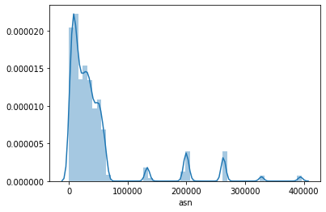

# Analysis and Mapping of Peeringdb Schemas

```python
import pandas as pd
import json
import bz2
import seaborn as sns
import json
```


```python
f = './peeringdb_dump_2016_01_01.json.bz2'

with bz2.open(f, 'rt') as dump:
    pdb1 = json.load(dump)
    
f = './peeringdb_2_dump_2017_01_31.json.bz2_'

with bz2.open(f, 'rt') as dump:
    pdb2 = json.load(dump)

f = './peeringdb_dump_2019_01_31.json.bz2_'

with bz2.open(f, 'rt') as dump:
    pdb3 = json.load(dump)
```

Following are they table names from the pre-2016 schema


```python
list(pdb1.keys())
```


    ['mgmtFacilities',
     'sqlite_sequence',
     'mgmtPublics',
     'mgmtPublicsFacilities',
     'mgmtPublicsIPs',
     'peerParticipants',
     'peerParticipantsContacts',
     'peerParticipantsPrivates',
     'peerParticipantsPublics']


and following are they table names from the 2017-18 schema


```python
list(pdb2.keys())
```


    ['django_migrations',
     'sqlite_sequence',
     'peeringdb_organization',
     'peeringdb_facility',
     'peeringdb_network',
     'peeringdb_ix',
     'peeringdb_ix_facility',
     'peeringdb_ixlan',
     'peeringdb_ixlan_prefix',
     'peeringdb_network_contact',
     'peeringdb_network_facility',
     'peeringdb_network_ixlan',
     'auth_group',
     'auth_group_permissions',
     'auth_user_groups',
     'auth_user_user_permissions',
     'django_admin_log',
     'django_content_type',
     'auth_permission',
     'auth_user',
     'django_session']


and here are they table names from the 2019 schema


```python
list(pdb3.keys())
```


    ['ixlan',
     'ixfac',
     'net',
     'ix',
     'netixlan',
     'api',
     'fac',
     'netfac',
     'org',
     'ixpfx',
     'poc']


__Exploring all the attributes of those tables__

__For 2016__


```python
for k,a in pdb1.items():
    print(k+" : "+ str(list(a[0].keys())))
```

    mgmtFacilities : ['id', 'approved', 'name', 'type', 'website', 'clli', 'rencode', 'npanxx', 'address1', 'address2', 'city', 'state', 'zipcode', 'country', 'notes']
    sqlite_sequence : ['name', 'seq']
    mgmtPublics : ['id', 'approved', 'name', 'name_long', 'ipaddr', 'city', 'country', 'region_continent', 'media', 'tech_email', 'tech_phone', 'policy_email', 'policy_phone', 'website', 'url_stats', 'proto_unicast', 'proto_multicast', 'proto_ipv6']
    mgmtPublicsFacilities : ['id', 'public_id', 'facility_id']
    mgmtPublicsIPs : ['id', 'public_id', 'type', 'address']
    peerParticipants : ['id', 'asn', 'name', 'aka', 'website', 'notes_public', 'notes_private', 'irr_as_set', 'info_traffic', 'info_ratio', 'info_scope', 'info_type', 'info_prefixes', 'info_lookingglass', 'info_routeserver', 'info_unicast', 'info_multicast', 'info_ipv6', 'policy_url', 'policy_general', 'policy_locations', 'policy_ratio', 'policy_contracts', 'policy_nopublic', 'policy_noprivate', 'date_created', 'date_lastupdated']
    peerParticipantsContacts : ['id', 'participant_id', 'role', 'name', 'telephone', 'email']
    peerParticipantsPrivates : ['id', 'participant_id', 'facility_id', 'local_asn', 'avail_sonet', 'avail_ethernet', 'avail_atm']
    peerParticipantsPublics : ['id', 'participant_id', 'public_id', 'local_asn', 'local_ipaddr', 'speed', 'protocol', 'pending']
    

__For 2017__


```python
for k,a in pdb2.items():
    if len(a) > 0:
        print(k+" : "+ str(list(a[0].keys())))
```

    django_migrations : ['id', 'app', 'name', 'applied']
    sqlite_sequence : ['name', 'seq']
    peeringdb_organization : ['id', 'status', 'created', 'updated', 'version', 'address1', 'address2', 'city', 'state', 'zipcode', 'country', 'name', 'website', 'notes']
    peeringdb_facility : ['id', 'status', 'created', 'updated', 'version', 'address1', 'address2', 'city', 'state', 'zipcode', 'country', 'name', 'website', 'clli', 'rencode', 'npanxx', 'notes', 'org_id']
    peeringdb_network : ['id', 'status', 'created', 'updated', 'version', 'asn', 'name', 'aka', 'irr_as_set', 'website', 'looking_glass', 'route_server', 'notes', 'notes_private', 'info_traffic', 'info_ratio', 'info_scope', 'info_type', 'info_prefixes4', 'info_prefixes6', 'info_unicast', 'info_multicast', 'info_ipv6', 'policy_url', 'policy_general', 'policy_locations', 'policy_ratio', 'policy_contracts', 'org_id']
    peeringdb_ix : ['id', 'status', 'created', 'updated', 'version', 'name', 'name_long', 'city', 'country', 'notes', 'region_continent', 'media', 'proto_unicast', 'proto_multicast', 'proto_ipv6', 'website', 'url_stats', 'tech_email', 'tech_phone', 'policy_email', 'policy_phone', 'org_id']
    peeringdb_ix_facility : ['id', 'status', 'created', 'updated', 'version', 'ix_id', 'fac_id']
    peeringdb_ixlan : ['id', 'status', 'created', 'updated', 'version', 'name', 'descr', 'mtu', 'vlan', 'dot1q_support', 'rs_asn', 'arp_sponge', 'ix_id']
    peeringdb_ixlan_prefix : ['id', 'status', 'created', 'updated', 'version', 'notes', 'protocol', 'prefix', 'ixlan_id']
    peeringdb_network_contact : ['id', 'status', 'created', 'updated', 'version', 'role', 'visible', 'name', 'phone', 'email', 'url', 'net_id']
    peeringdb_network_facility : ['id', 'status', 'created', 'updated', 'version', 'local_asn', 'avail_sonet', 'avail_ethernet', 'avail_atm', 'net_id', 'fac_id']
    peeringdb_network_ixlan : ['id', 'status', 'created', 'updated', 'version', 'asn', 'ipaddr4', 'ipaddr6', 'is_rs_peer', 'notes', 'speed', 'net_id', 'ixlan_id']
    django_content_type : ['id', 'app_label', 'model']
    auth_permission : ['id', 'content_type_id', 'codename', 'name']
    

__For 2019__


```python
for k,a in pdb3.items():
    if 'data' in a.keys():
        print(k+" : "+ str(list(a['data'][0].keys())))
```

    ixlan : ['ix_id', 'status', 'updated', 'descr', 'dot1q_support', 'created', 'rs_asn', 'mtu', 'arp_sponge', 'id', 'name']
    ixfac : ['ix_id', 'status', 'updated', 'created', 'fac_id', 'id']
    net : ['website', 'looking_glass', 'route_server', 'info_ratio', 'id', 'policy_ratio', 'info_unicast', 'policy_general', 'status', 'updated', 'info_traffic', 'info_multicast', 'asn', 'policy_locations', 'name', 'info_scope', 'notes', 'created', 'org_id', 'policy_url', 'info_ipv6', 'info_type', 'info_prefixes6', 'aka', 'info_prefixes4', 'policy_contracts', 'irr_as_set']
    ix : ['proto_ipv6', 'city', 'updated', 'policy_email', 'name', 'tech_phone', 'country', 'notes', 'created', 'org_id', 'proto_multicast', 'proto_unicast', 'website', 'policy_phone', 'status', 'media', 'id', 'name_long', 'tech_email', 'url_stats', 'region_continent']
    netixlan : ['ix_id', 'status', 'updated', 'name', 'created', 'ixlan_id', 'notes', 'ipaddr4', 'net_id', 'is_rs_peer', 'id', 'ipaddr6', 'speed', 'asn']
    fac : ['org_name', 'website', 'updated', 'clli', 'name', 'created', 'net_count', 'address1', 'notes', 'org_id', 'npanxx', 'longitude', 'zipcode', 'address2', 'state', 'status', 'country', 'latitude', 'id', 'rencode', 'city']
    netfac : ['status', 'city', 'updated', 'name', 'created', 'country', 'local_asn', 'fac_id', 'net_id', 'id']
    org : ['website', 'city', 'updated', 'address2', 'name', 'created', 'address1', 'notes', 'zipcode', 'state', 'status', 'country', 'id']
    ixpfx : ['status', 'updated', 'protocol', 'created', 'prefix', 'ixlan_id', 'id']
    poc : ['status', 'updated', 'name', 'created', 'url', 'visible', 'email', 'phone', 'role', 'id', 'net_id']
    


```python
mgmtPublics_2016 = pdb1['mgmtPublics']
```

Choosing the table that can be potentially mapped for further analysis


```python
mgmtPublics_2016 = pd.DataFrame(mgmtPublics_2016)
```


```python
mgmtPublics_2016.sample(10)
```


<div>
<style scoped>
    .dataframe tbody tr th:only-of-type {
        vertical-align: middle;
    }

    .dataframe tbody tr th {
        vertical-align: top;
    }

    .dataframe thead th {
        text-align: right;
    }
</style>
<table border="1" class="dataframe">
  <thead>
    <tr style="text-align: right;">
      <th></th>
      <th>id</th>
      <th>approved</th>
      <th>name</th>
      <th>name_long</th>
      <th>ipaddr</th>
      <th>city</th>
      <th>country</th>
      <th>region_continent</th>
      <th>media</th>
      <th>tech_email</th>
      <th>tech_phone</th>
      <th>policy_email</th>
      <th>policy_phone</th>
      <th>website</th>
      <th>url_stats</th>
      <th>proto_unicast</th>
      <th>proto_multicast</th>
      <th>proto_ipv6</th>
    </tr>
  </thead>
  <tbody>
    <tr>
      <td>452</td>
      <td>888</td>
      <td>Y</td>
      <td>Cool Ideas</td>
      <td>Cool Ideas Service Provider</td>
      <td>154.0.0.0/20</td>
      <td>Johannesburg</td>
      <td>ZA</td>
      <td>Africa</td>
      <td>Ethernet</td>
      <td>paul@cisp.co.za</td>
      <td>+27105932665</td>
      <td>paul@cisp.co.za</td>
      <td>+27105932665</td>
      <td>www.cisp.co.za</td>
      <td>None</td>
      <td>1</td>
      <td>0</td>
      <td>0</td>
    </tr>
    <tr>
      <td>385</td>
      <td>766</td>
      <td>Y</td>
      <td>DN-IX</td>
      <td>Donetsk Internet eXchange</td>
      <td>193.34.203.0/25</td>
      <td>Donetsk</td>
      <td>UA</td>
      <td>Europe</td>
      <td>Ethernet</td>
      <td>ala@dn.ua</td>
      <td>+380 340 5700</td>
      <td>ala@dn.ua</td>
      <td>+380 97 54 00 504</td>
      <td>ix.dn.ua</td>
      <td>None</td>
      <td>1</td>
      <td>0</td>
      <td>1</td>
    </tr>
    <tr>
      <td>98</td>
      <td>128</td>
      <td>Y</td>
      <td>SOLIX</td>
      <td>Stockholm Open Local Internet Exchange</td>
      <td>193.110.12.0/24 193.110.13.0/24 193.108.17.0/24</td>
      <td>Stockholm</td>
      <td>SE</td>
      <td>Europe</td>
      <td>Ethernet</td>
      <td>kontakt@sol-ix.net</td>
      <td>None</td>
      <td>kontakt@sol-ix.net</td>
      <td>None</td>
      <td>http://www.solix.se/</td>
      <td>http://www.solix.se/stats.php</td>
      <td>1</td>
      <td>1</td>
      <td>1</td>
    </tr>
    <tr>
      <td>365</td>
      <td>676</td>
      <td>Y</td>
      <td>ECIX-FRA</td>
      <td>European Commercial Internet Exchange Frankfurt</td>
      <td>62.69.146.0/23</td>
      <td>Frankfurt</td>
      <td>DE</td>
      <td>Europe</td>
      <td>Ethernet</td>
      <td>support@ecix.net</td>
      <td>+49 30 81495450</td>
      <td>support@ecix.net</td>
      <td>+49 30 81495450</td>
      <td>http://www.ecix.net</td>
      <td>https://www.ecix.net/statistics/</td>
      <td>1</td>
      <td>0</td>
      <td>1</td>
    </tr>
    <tr>
      <td>405</td>
      <td>816</td>
      <td>Y</td>
      <td>Univox</td>
      <td>Univox Minas Gerais Telecomunicações Ltda</td>
      <td>189.36.144.0/20</td>
      <td>São Sebastião do Paraíso - MG</td>
      <td>BR</td>
      <td>South America</td>
      <td>Multiple</td>
      <td>samuel@univox.com.br</td>
      <td>+55 35-91053651</td>
      <td>suporte@univox.com.br</td>
      <td>+55 35-35392500</td>
      <td>http://www.univox.com.br</td>
      <td>None</td>
      <td>1</td>
      <td>0</td>
      <td>1</td>
    </tr>
    <tr>
      <td>273</td>
      <td>416</td>
      <td>Y</td>
      <td>Powernetix</td>
      <td>Powernetix</td>
      <td>202.85.224.0/20</td>
      <td>Hong Kong</td>
      <td>HK</td>
      <td>Asia Pacific</td>
      <td>Ethernet</td>
      <td>noc@powernetix.com</td>
      <td>+852 2189 7222</td>
      <td>noc@powernetix.com</td>
      <td>+852 2189 7222</td>
      <td>www.powernetix.com</td>
      <td>None</td>
      <td>1</td>
      <td>0</td>
      <td>0</td>
    </tr>
    <tr>
      <td>543</td>
      <td>1052</td>
      <td>Y</td>
      <td>SIXP</td>
      <td>Serekunda Internet Exchange Point</td>
      <td>196.223.34.0/24, 196.49.1.0/27</td>
      <td>Serekunda</td>
      <td>GM</td>
      <td>Africa</td>
      <td>Ethernet</td>
      <td>tech@sixp.gm</td>
      <td>+220 396 1000</td>
      <td>admin@sixp.gm</td>
      <td>+220 3100103</td>
      <td>www.sixp.gm</td>
      <td>None</td>
      <td>1</td>
      <td>0</td>
      <td>0</td>
    </tr>
    <tr>
      <td>285</td>
      <td>452</td>
      <td>Y</td>
      <td>BIXc</td>
      <td>Biznet Internet Exchange</td>
      <td>218.100.41.0/24</td>
      <td>Jakarta</td>
      <td>ID</td>
      <td>Asia Pacific</td>
      <td>Ethernet</td>
      <td>noc@biznetnetworks.com</td>
      <td>+62-21-57998888</td>
      <td>peering@biznetnetworks.com</td>
      <td>+62-21-57998888</td>
      <td>http://www.biznetnetworks.com/En/?menu=Bix</td>
      <td>None</td>
      <td>1</td>
      <td>0</td>
      <td>0</td>
    </tr>
    <tr>
      <td>550</td>
      <td>1063</td>
      <td>Y</td>
      <td>PT.Pastindo Sejahtera Bersama</td>
      <td>PT.Pastindo Sejahtera Bersama</td>
      <td>114.6.53.0/28</td>
      <td>Medan</td>
      <td>ID</td>
      <td>Asia Pacific</td>
      <td>Ethernet</td>
      <td>support@pastindo.com</td>
      <td>+628218219</td>
      <td>info@pastindo.com</td>
      <td>+628218219</td>
      <td>http://www.pastindo.net</td>
      <td>None</td>
      <td>1</td>
      <td>0</td>
      <td>0</td>
    </tr>
    <tr>
      <td>198</td>
      <td>283</td>
      <td>Y</td>
      <td>UppRIX</td>
      <td>Uppsala regional Internet exchange</td>
      <td>195.189.188.0/25, 195.189.189.0/25, 195.189.18...</td>
      <td>Uppsala</td>
      <td>SE</td>
      <td>Europe</td>
      <td>Ethernet</td>
      <td>kontakt@upprix.se</td>
      <td>+46 18 678120</td>
      <td>kontakt@upprix.se</td>
      <td>+46 18 678120</td>
      <td>www.upprix.se</td>
      <td>None</td>
      <td>1</td>
      <td>1</td>
      <td>1</td>
    </tr>
  </tbody>
</table>
</div>


```python
peerParticipantsPublics_2016 = pd.DataFrame(pdb1['peerParticipantsPublics'])
```


```python
peerParticipantsPublics_2017 = pd.DataFrame(pdb2['peeringdb_network_ixlan'])
```


```python
peerParticipantsPublics_2019 = pd.DataFrame(pdb3['netixlan']['data'])
```


```python
peerParticipantsPublics_2016.columns
```


    Index(['id', 'participant_id', 'public_id', 'local_asn', 'local_ipaddr',
           'speed', 'protocol', 'pending'],
          dtype='object')


```python
peerParticipantsPublics_2017.columns
```


    Index(['id', 'status', 'created', 'updated', 'version', 'asn', 'ipaddr4',
           'ipaddr6', 'is_rs_peer', 'notes', 'speed', 'net_id', 'ixlan_id'],
          dtype='object')


```python
peerParticipantsPublics_2019.columns
```


    Index(['ix_id', 'status', 'updated', 'name', 'created', 'ixlan_id', 'notes',
           'ipaddr4', 'net_id', 'is_rs_peer', 'id', 'ipaddr6', 'speed', 'asn'],
          dtype='object')


```python
mgmtPublics_2017 = pd.DataFrame(pdb2['peeringdb_ix'])
```


```python
mgmtPublics_2019 = pd.DataFrame(pdb3['ix']['data'])
```

__Comparing table summaries__


```python
peerParticipantsPublics_2016.describe()
```


<div>
<style scoped>
    .dataframe tbody tr th:only-of-type {
        vertical-align: middle;
    }

    .dataframe tbody tr th {
        vertical-align: top;
    }

    .dataframe thead th {
        text-align: right;
    }
</style>
<table border="1" class="dataframe">
  <thead>
    <tr style="text-align: right;">
      <th></th>
      <th>id</th>
      <th>participant_id</th>
      <th>public_id</th>
      <th>local_asn</th>
      <th>speed</th>
    </tr>
  </thead>
  <tbody>
    <tr>
      <td>count</td>
      <td>25876.000000</td>
      <td>25876.000000</td>
      <td>25876.000000</td>
      <td>25876.000000</td>
      <td>2.587600e+04</td>
    </tr>
    <tr>
      <td>mean</td>
      <td>18753.839388</td>
      <td>3169.782849</td>
      <td>212.576635</td>
      <td>35066.245942</td>
      <td>3.155942e+04</td>
    </tr>
    <tr>
      <td>std</td>
      <td>9234.999392</td>
      <td>2458.330954</td>
      <td>261.804812</td>
      <td>50515.579668</td>
      <td>1.395671e+06</td>
    </tr>
    <tr>
      <td>min</td>
      <td>23.000000</td>
      <td>1.000000</td>
      <td>1.000000</td>
      <td>3.000000</td>
      <td>0.000000e+00</td>
    </tr>
    <tr>
      <td>25%</td>
      <td>11231.750000</td>
      <td>996.000000</td>
      <td>31.000000</td>
      <td>9070.000000</td>
      <td>1.000000e+03</td>
    </tr>
    <tr>
      <td>50%</td>
      <td>19451.500000</td>
      <td>2727.000000</td>
      <td>98.000000</td>
      <td>22822.000000</td>
      <td>2.000000e+03</td>
    </tr>
    <tr>
      <td>75%</td>
      <td>26745.250000</td>
      <td>4961.000000</td>
      <td>301.000000</td>
      <td>39832.000000</td>
      <td>1.000000e+04</td>
    </tr>
    <tr>
      <td>max</td>
      <td>33588.000000</td>
      <td>9292.000000</td>
      <td>1198.000000</td>
      <td>464889.000000</td>
      <td>1.000000e+08</td>
    </tr>
  </tbody>
</table>
</div>


```python
peerParticipantsPublics_2017.describe()
```


<div>
<style scoped>
    .dataframe tbody tr th:only-of-type {
        vertical-align: middle;
    }

    .dataframe tbody tr th {
        vertical-align: top;
    }

    .dataframe thead th {
        text-align: right;
    }
</style>
<table border="1" class="dataframe">
  <thead>
    <tr style="text-align: right;">
      <th></th>
      <th>id</th>
      <th>version</th>
      <th>asn</th>
      <th>is_rs_peer</th>
      <th>speed</th>
      <th>net_id</th>
      <th>ixlan_id</th>
    </tr>
  </thead>
  <tbody>
    <tr>
      <td>count</td>
      <td>20225.00000</td>
      <td>20225.0</td>
      <td>20225.000000</td>
      <td>20225.000000</td>
      <td>2.022500e+04</td>
      <td>20225.000000</td>
      <td>20225.000000</td>
    </tr>
    <tr>
      <td>mean</td>
      <td>19780.37152</td>
      <td>0.0</td>
      <td>46564.482077</td>
      <td>0.225760</td>
      <td>1.178703e+04</td>
      <td>4319.579481</td>
      <td>280.477577</td>
    </tr>
    <tr>
      <td>std</td>
      <td>8841.32423</td>
      <td>0.0</td>
      <td>66131.918954</td>
      <td>0.418092</td>
      <td>7.714465e+04</td>
      <td>3417.282339</td>
      <td>330.747485</td>
    </tr>
    <tr>
      <td>min</td>
      <td>1.00000</td>
      <td>0.0</td>
      <td>42.000000</td>
      <td>0.000000</td>
      <td>0.000000e+00</td>
      <td>1.000000</td>
      <td>1.000000</td>
    </tr>
    <tr>
      <td>25%</td>
      <td>13375.00000</td>
      <td>0.0</td>
      <td>11404.000000</td>
      <td>0.000000</td>
      <td>1.000000e+03</td>
      <td>1381.000000</td>
      <td>31.000000</td>
    </tr>
    <tr>
      <td>50%</td>
      <td>21067.00000</td>
      <td>0.0</td>
      <td>27984.000000</td>
      <td>0.000000</td>
      <td>1.000000e+04</td>
      <td>3570.000000</td>
      <td>158.000000</td>
    </tr>
    <tr>
      <td>75%</td>
      <td>27338.00000</td>
      <td>0.0</td>
      <td>47541.000000</td>
      <td>0.000000</td>
      <td>1.000000e+04</td>
      <td>6578.000000</td>
      <td>375.000000</td>
    </tr>
    <tr>
      <td>max</td>
      <td>32729.00000</td>
      <td>0.0</td>
      <td>395853.000000</td>
      <td>1.000000</td>
      <td>1.000000e+07</td>
      <td>12360.000000</td>
      <td>1362.000000</td>
    </tr>
  </tbody>
</table>
</div>


```python
peerParticipantsPublics_2019.describe()
```


<div>
<style scoped>
    .dataframe tbody tr th:only-of-type {
        vertical-align: middle;
    }

    .dataframe tbody tr th {
        vertical-align: top;
    }

    .dataframe thead th {
        text-align: right;
    }
</style>
<table border="1" class="dataframe">
  <thead>
    <tr style="text-align: right;">
      <th></th>
      <th>ix_id</th>
      <th>ixlan_id</th>
      <th>net_id</th>
      <th>id</th>
      <th>speed</th>
      <th>asn</th>
    </tr>
  </thead>
  <tbody>
    <tr>
      <td>count</td>
      <td>26576.000000</td>
      <td>26576.000000</td>
      <td>26576.000000</td>
      <td>26576.000000</td>
      <td>2.657600e+04</td>
      <td>26576.000000</td>
    </tr>
    <tr>
      <td>mean</td>
      <td>416.551023</td>
      <td>421.345161</td>
      <td>6682.440585</td>
      <td>28696.032962</td>
      <td>1.532575e+04</td>
      <td>62279.987921</td>
    </tr>
    <tr>
      <td>std</td>
      <td>517.514309</td>
      <td>467.058736</td>
      <td>5310.109640</td>
      <td>12233.785868</td>
      <td>4.113762e+04</td>
      <td>81322.377710</td>
    </tr>
    <tr>
      <td>min</td>
      <td>1.000000</td>
      <td>1.000000</td>
      <td>2.000000</td>
      <td>38.000000</td>
      <td>0.000000e+00</td>
      <td>42.000000</td>
    </tr>
    <tr>
      <td>25%</td>
      <td>53.000000</td>
      <td>53.000000</td>
      <td>2079.000000</td>
      <td>19665.750000</td>
      <td>1.000000e+03</td>
      <td>13576.000000</td>
    </tr>
    <tr>
      <td>50%</td>
      <td>174.000000</td>
      <td>177.000000</td>
      <td>5365.000000</td>
      <td>30494.500000</td>
      <td>1.000000e+04</td>
      <td>32934.000000</td>
    </tr>
    <tr>
      <td>75%</td>
      <td>597.000000</td>
      <td>676.000000</td>
      <td>10892.750000</td>
      <td>38999.250000</td>
      <td>1.000000e+04</td>
      <td>55675.250000</td>
    </tr>
    <tr>
      <td>max</td>
      <td>2495.000000</td>
      <td>1784.000000</td>
      <td>18959.000000</td>
      <td>46943.000000</td>
      <td>3.072000e+06</td>
      <td>397165.000000</td>
    </tr>
  </tbody>
</table>
</div>


__Comparing distribution of asn__


```python
sns.distplot(peerParticipantsPublics_2016.local_asn)
```


    <matplotlib.axes._subplots.AxesSubplot at 0x22da964c4a8>


```python
sns.distplot(peerParticipantsPublics_2017.asn)
```


    <matplotlib.axes._subplots.AxesSubplot at 0x22da48cee10>





```python
sns.distplot(peerParticipantsPublics_2019.asn)
```


    <matplotlib.axes._subplots.AxesSubplot at 0x22da4b3aa90>


```python
mgmtPublics_2016.describe()
```


<div>
<style scoped>
    .dataframe tbody tr th:only-of-type {
        vertical-align: middle;
    }

    .dataframe tbody tr th {
        vertical-align: top;
    }

    .dataframe thead th {
        text-align: right;
    }
</style>
<table border="1" class="dataframe">
  <thead>
    <tr style="text-align: right;">
      <th></th>
      <th>id</th>
    </tr>
  </thead>
  <tbody>
    <tr>
      <td>count</td>
      <td>628.000000</td>
    </tr>
    <tr>
      <td>mean</td>
      <td>567.474522</td>
    </tr>
    <tr>
      <td>std</td>
      <td>377.485707</td>
    </tr>
    <tr>
      <td>min</td>
      <td>1.000000</td>
    </tr>
    <tr>
      <td>25%</td>
      <td>216.750000</td>
    </tr>
    <tr>
      <td>50%</td>
      <td>528.500000</td>
    </tr>
    <tr>
      <td>75%</td>
      <td>923.250000</td>
    </tr>
    <tr>
      <td>max</td>
      <td>1191.000000</td>
    </tr>
  </tbody>
</table>
</div>


```python
mgmtPublics_2017.describe()
```


<div>
<style scoped>
    .dataframe tbody tr th:only-of-type {
        vertical-align: middle;
    }

    .dataframe tbody tr th {
        vertical-align: top;
    }

    .dataframe thead th {
        text-align: right;
    }
</style>
<table border="1" class="dataframe">
  <thead>
    <tr style="text-align: right;">
      <th></th>
      <th>id</th>
      <th>version</th>
      <th>proto_unicast</th>
      <th>proto_multicast</th>
      <th>proto_ipv6</th>
      <th>org_id</th>
    </tr>
  </thead>
  <tbody>
    <tr>
      <td>count</td>
      <td>653.000000</td>
      <td>653.0</td>
      <td>653.000000</td>
      <td>653.000000</td>
      <td>653.000000</td>
      <td>653.000000</td>
    </tr>
    <tr>
      <td>mean</td>
      <td>678.297090</td>
      <td>0.0</td>
      <td>0.977029</td>
      <td>0.218989</td>
      <td>0.761103</td>
      <td>6642.886677</td>
    </tr>
    <tr>
      <td>std</td>
      <td>480.261969</td>
      <td>0.0</td>
      <td>0.149926</td>
      <td>0.413878</td>
      <td>0.426737</td>
      <td>5774.771206</td>
    </tr>
    <tr>
      <td>min</td>
      <td>1.000000</td>
      <td>0.0</td>
      <td>0.000000</td>
      <td>0.000000</td>
      <td>0.000000</td>
      <td>2.000000</td>
    </tr>
    <tr>
      <td>25%</td>
      <td>235.000000</td>
      <td>0.0</td>
      <td>1.000000</td>
      <td>0.000000</td>
      <td>1.000000</td>
      <td>644.000000</td>
    </tr>
    <tr>
      <td>50%</td>
      <td>610.000000</td>
      <td>0.0</td>
      <td>1.000000</td>
      <td>0.000000</td>
      <td>1.000000</td>
      <td>7084.000000</td>
    </tr>
    <tr>
      <td>75%</td>
      <td>1082.000000</td>
      <td>0.0</td>
      <td>1.000000</td>
      <td>0.000000</td>
      <td>1.000000</td>
      <td>12394.000000</td>
    </tr>
    <tr>
      <td>max</td>
      <td>1577.000000</td>
      <td>0.0</td>
      <td>1.000000</td>
      <td>1.000000</td>
      <td>1.000000</td>
      <td>15910.000000</td>
    </tr>
  </tbody>
</table>
</div>


```python
mgmtPublics_2019.describe()
```


<div>
<style scoped>
    .dataframe tbody tr th:only-of-type {
        vertical-align: middle;
    }

    .dataframe tbody tr th {
        vertical-align: top;
    }

    .dataframe thead th {
        text-align: right;
    }
</style>
<table border="1" class="dataframe">
  <thead>
    <tr style="text-align: right;">
      <th></th>
      <th>org_id</th>
      <th>id</th>
    </tr>
  </thead>
  <tbody>
    <tr>
      <td>count</td>
      <td>646.000000</td>
      <td>646.000000</td>
    </tr>
    <tr>
      <td>mean</td>
      <td>8032.777090</td>
      <td>946.659443</td>
    </tr>
    <tr>
      <td>std</td>
      <td>6923.129121</td>
      <td>744.806451</td>
    </tr>
    <tr>
      <td>min</td>
      <td>2.000000</td>
      <td>1.000000</td>
    </tr>
    <tr>
      <td>25%</td>
      <td>791.000000</td>
      <td>276.500000</td>
    </tr>
    <tr>
      <td>50%</td>
      <td>7823.000000</td>
      <td>788.000000</td>
    </tr>
    <tr>
      <td>75%</td>
      <td>14444.000000</td>
      <td>1489.750000</td>
    </tr>
    <tr>
      <td>max</td>
      <td>22009.000000</td>
      <td>2495.000000</td>
    </tr>
  </tbody>
</table>
</div>


__Comparing `region continent` distribution__


```python
mgmtPublics_2016.region_continent.value_counts()
```


    Europe           228
    North America    137
    Asia Pacific     105
    South America     83
    Africa            36
    Australia         26
    Middle East       13
    Name: region_continent, dtype: int64


```python
mgmtPublics_2017.region_continent.value_counts()
```


    Europe           236
    North America    149
    Asia Pacific     112
    South America     69
    Africa            45
    Australia         29
    Middle East       13
    Name: region_continent, dtype: int64


```python
mgmtPublics_2019.region_continent.value_counts()
```


    Europe           235
    North America    136
    Asia Pacific     113
    South America     82
    Africa            41
    Australia         27
    Middle East       12
    Name: region_continent, dtype: int64


__Mapping and saving modified dumps__


```python
peerParticipantsPublics_2017.rename(columns = {'asn':'local_asn', 'net_id':'participant_id', 'ixlan_id':'public_id'}, errors='raise', inplace = True)

pdb2['peerParticipantsPublics'] = peerParticipantsPublics_2017.to_dict()

pdb2['mgmtPublics'] = mgmtPublics_2017.to_dict()

with bz2.open('peeringdb_2_dump_2017_01_31.json.bz2', 'wt') as f:
        json.dump(pdb2, f)
        

        
peerParticipantsPublics_2019.rename(columns = {'asn':'local_asn', 'net_id':'participant_id', 'ixlan_id':'public_id'}, errors='raise', inplace = True)

pdb3['peerParticipantsPublics'] = peerParticipantsPublics_2019.to_dict()

pdb3['mgmtPublics'] = mgmtPublics_2019.to_dict()

with bz2.open('peeringdb_dump_2019_01_31.json.bz2', 'wt') as f:
        json.dump(pdb3, f)
```

## Conclusion
- The peeringdb tables being used in the codebase are `mgmtPublics` and `peerParticipantsPublics` (according to 2016 schema). See function `load_peeringdb` in `code/utils/tb_common/load_data.py`
- Potential mapping tables for `mgmtPublics` and `peerParticipantsPublics` are `peeringdb_ix`, `peeringdb_network_ixlan` from 2017 and `ix` and `netixlan` from 2019, respectively.
- The hypothesis that these tables could be the mapped was driven by the attributes of the columns like `asn` and `region_continent`, which are being used in the codesbase.
- To fix the differences in schemas a mapping has been created to match the 2017 and 2019 schemas to 2016 one (only for the tables and attributes being used in `tb_common`).
